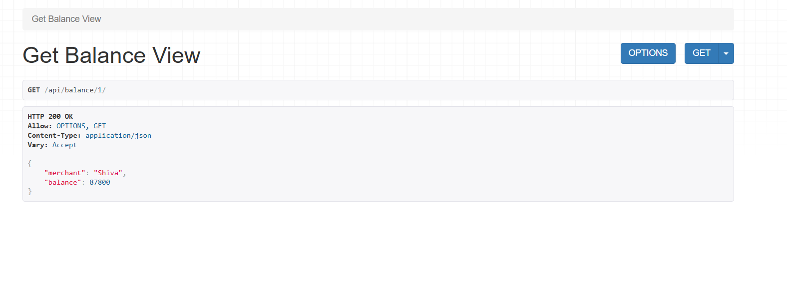
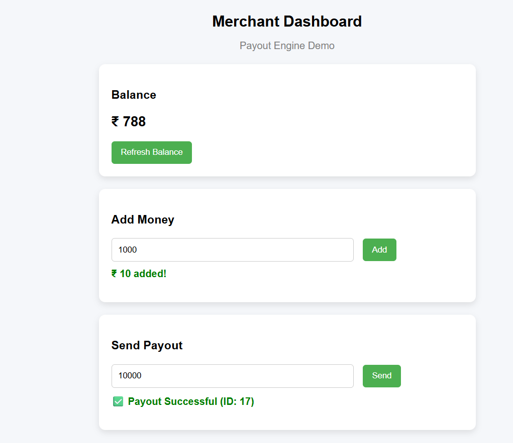
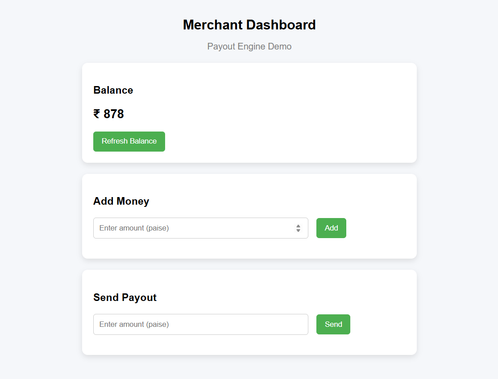
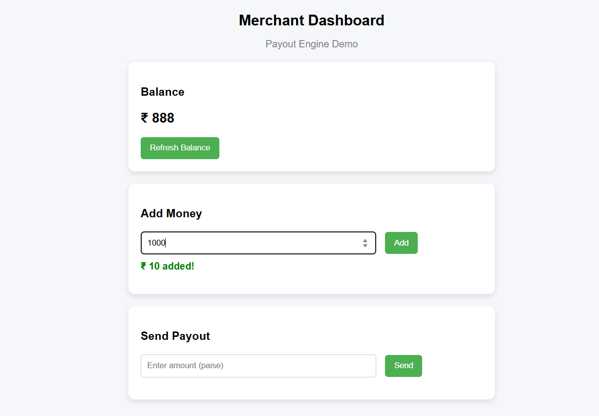
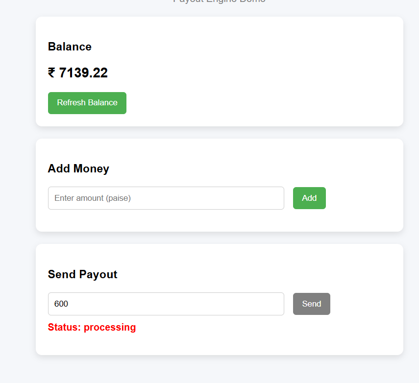
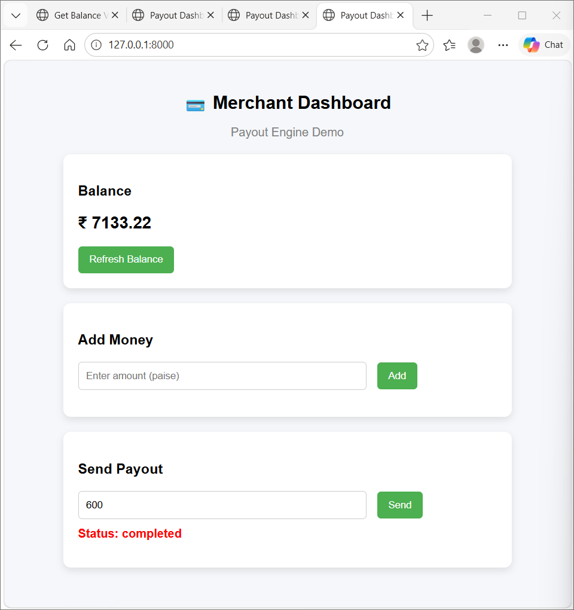

# 💸 Payout Engine (Django)

A mini payout system built using Django that simulates real-world fintech behavior such as ledger-based balance management, idempotent payout APIs, and concurrency-safe transactions.

---

## 🌍 Live Demo

👉 **Live Link:** https://payout-engine-f109.onrender.com/

---

## 🚀 Features

* 💰 Ledger-based accounting (credit & debit entries)
* 📊 Balance calculation (no direct balance storage)
* 📤 Payout API with validation
* 🔁 Idempotency support (prevents duplicate payouts)
* 🔒 Concurrency-safe transactions using database locking
* 🔄 Background payout processing (worker simulation)
* 🌐 Simple frontend dashboard (HTML + CSS + JS)
* 💵 Add money feature for testing/demo

---

## 🧱 Tech Stack

* Backend: Django, Django REST Framework
* Database: SQLite (can be switched to PostgreSQL)
* Frontend: HTML, CSS, JavaScript
* API Testing: Thunder Client / Postman

---

## 📁 Project Structure

```
payout/
│
├── core/              
├── payout/            
├── templates/         
├── images/            
│   ├── one.png
│   ├── two.png
│   ├── three.png
│   ├── four.png
│   ├── five.png
│   └── six.png
├── manage.py
├── README.md
├── EXPLAINER.md
```

---

## ⚙️ Setup Instructions

### 1. Clone repository

```bash
git clone <your-repo-link>
cd payout
```

---

### 2. Install dependencies

```bash
pip install -r requirements.txt
```

---

### 3. Run migrations

```bash
python manage.py makemigrations
python manage.py migrate
```

---

### 4. Run server

```bash
python manage.py runserver
```

---

### 5. Open app

```
http://127.0.0.1:8000/
```

---

## 🌐 API Endpoints

### 🔹 Get Balance

```
GET /api/balance/<merchant_id>/
```

### 🔹 Create Payout

```
POST /api/payout/<merchant_id>/
```

**Headers:**

```
Idempotency-Key: unique_key
Content-Type: application/json
```

### 🔹 Add Money

```
POST /api/add-money/<merchant_id>/
```

### 🔹 Payout Status

```
GET /api/payout-status/<payout_id>/
```

---

## 🧠 Core Concepts

### 💰 Ledger System

```
Balance = Total Credits - Total Debits
```

### 🔁 Idempotency

* Prevents duplicate payouts
* Uses `Idempotency-Key` header
* Stores response for repeated requests

### 🔒 Concurrency Handling

* Uses `transaction.atomic()`
* Uses `select_for_update()`
* Prevents race conditions

### 🔄 Background Processing

```
pending → processing → completed / failed
```

Run worker:

```bash
python manage.py process_payouts
```

---

## 🎨 Frontend

* View balance
* Add money
* Send payout
* Track payout status

---

## 🧪 Demo Setup

For demonstration purposes, a default merchant is automatically created when the application loads.

This ensures the system works out-of-the-box without requiring manual database setup.

In a production environment, merchants would be created through a proper onboarding flow.

---

## 📸 Working Images of Project

<p align="center">
  
  
  
  
  
  
</p>

---

## ⚠️ Notes

* Uses SQLite for development
* Django development server is not suitable for production

---

## 📌 Future Improvements

* Celery / background worker
* Retry mechanism
* Authentication system
* React frontend

---

## 👨‍💻 Author

Shiva Kumar

---

## 📄 Additional Docs

* See `EXPLAINER.md`
